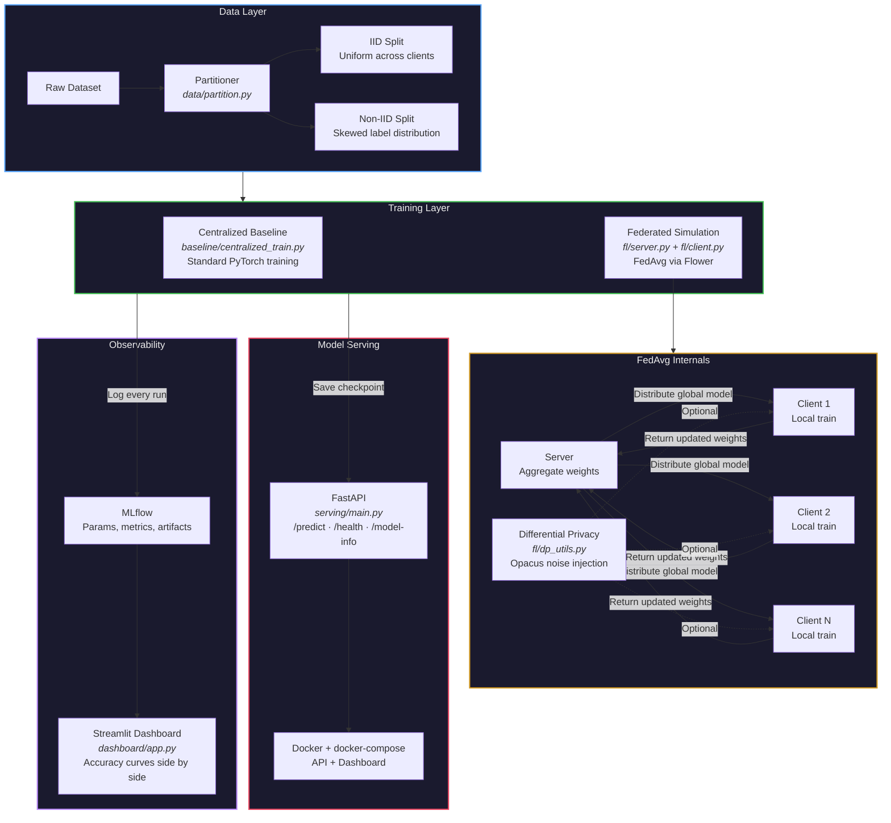
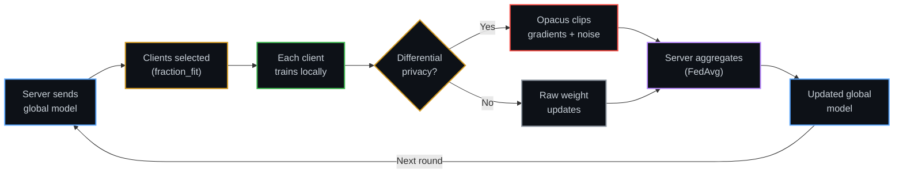
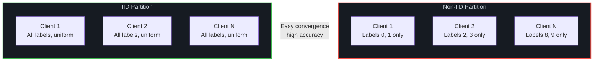

<div align="center">

# Federated Learning Simulation

**Privacy-preserving ML pipeline — FedAvg across virtual clients, benchmarked against centralized training**

[](https://python.org)
[](https://pytorch.org)
[](https://flower.ai)
[](https://opacus.ai)
[](https://mlflow.org)
[](https://docker.com)
[](LICENSE)

<br/>

*FedAvg Simulation · IID vs Non-IID · Client Dropout · Differential Privacy · MLflow Tracking · Dockerized Serving*

A hands-on testbed for the core trade-offs in federated systems: accuracy vs. privacy, IID vs. non-IID, full vs. partial client participation.

<br/>

[Architecture](#architecture) · [Running Experiments](#running-the-experiments) · [Results](#results) · [Setup](#setup)

---

</div>

## Table of Contents

<details>
<summary><b>Click to expand</b></summary>

1. [Overview](#overview)
2. [Architecture](#architecture)
3. [Features](#features)
4. [Screenshots](#screenshots)
5. [Tech Stack](#tech-stack)
6. [Setup](#setup)
7. [Running the Experiments](#running-the-experiments)
8. [Dashboard](#dashboard)
9. [Serving the Final Model](#serving-the-final-model)
10. [Project Structure](#project-structure)
11. [Results](#results)
12. [Stretch Ideas](#stretch-ideas)
13. [License](#license)

</details>

---

## Overview

This project builds a federated learning simulation (Flower + PyTorch) benchmarking **FedAvg against centralized training** across IID and non-IID data splits, with client dropout modeling and an optional differential privacy layer. All experiments are tracked in MLflow, visualized in a Streamlit dashboard, and the final model-serving API is containerized with Docker for reproducible deployment.

> [!NOTE]
> **Why federated learning matters:** multiple parties can train a shared model without pooling raw data. This repo is a hands-on testbed for the core trade-offs — accuracy vs. privacy, IID vs. non-IID distributions, full vs. partial client participation — that show up in real federated systems.

---

## Architecture

### End-to-End Pipeline



### FedAvg Round Lifecycle



### IID vs Non-IID Data Partitioning



> [!IMPORTANT]
> Non-IID partitioning is where federated learning gets hard. When each client only sees a subset of labels, the local models diverge — FedAvg must reconcile conflicting gradients during aggregation. This is the most realistic simulation of real-world federated scenarios (hospitals seeing different patient populations, phones with different usage patterns).

---

## Features

| Feature | Description |
|:---|:---|
| **FedAvg simulation** | N virtual clients coordinated via [Flower](https://flower.ai/) |
| **IID vs Non-IID** | Direct comparison of uniform vs. skewed data partitioning |
| **Centralized baseline** | Quantify the federated "cost" — how much accuracy you trade for privacy |
| **Client dropout** | Simulate partial participation per round (configurable `fraction_fit`) |
| **Differential privacy** | Optional Opacus layer for gradient clipping + noise injection |
| **Experiment tracking** | Every run logged to MLflow (params + metrics + artifacts) |
| **Comparison dashboard** | Streamlit app plotting accuracy curves side by side |
| **Dockerized serving** | FastAPI endpoint for the final global model, containerized with docker-compose |

---

## Screenshots

| Dashboard | Serving API |
|:---:|:---:|
| .png) | .png) |

---

## Tech Stack

| Layer | Tools | Purpose |
|:---|:---|:---|
| Modeling | Python, PyTorch | Neural network training |
| Federation | Flower (`flwr`) | FedAvg strategy, client/server simulation |
| Privacy | Opacus | Optional per-client differential privacy |
| Experiment tracking | MLflow | Params, metrics, artifacts per run |
| Dashboard | Streamlit | Side-by-side accuracy curve comparison |
| Serving | FastAPI + Uvicorn | REST API for the final global model |
| Deployment | Docker, docker-compose | Reproducible containerized serving |

---

## Setup

```bash
git clone https://github.com/AnshumanJ28/federated-learning-sim.git
cd federated-learning-sim
pip install -r requirements.txt
```

> [!TIP]
> Opacus (for differential privacy) is included in `requirements.txt` but entirely optional — all experiments run without it. Pass `--use-dp` only when you want to measure the privacy/accuracy trade-off.

---

## Running the Experiments

### 1. Build partitions (IID + non-IID)

```bash
python -m data.partition
```

### 2. Centralized baseline

```bash
python -m baseline.centralized_train --epochs 10
```

### 3. Federated experiments

| Experiment | Command |
|:---|:---|
| **IID, full participation** | `python -m fl.server --partition iid --rounds 20 --num-clients 10` |
| **Non-IID, full participation** | `python -m fl.server --partition non_iid --rounds 20 --num-clients 10` |
| **Non-IID, 60% dropout** | `python -m fl.server --partition non_iid --rounds 20 --fraction-fit 0.6` |
| **IID, with differential privacy** | `python -m fl.server --partition iid --rounds 20 --use-dp` |

### 4. View experiment logs

```bash
mlflow ui
```

Each run logs parameters and metrics to `./mlruns`. The MLflow UI lets you compare runs side by side.

---

## Dashboard

```bash
streamlit run dashboard/app.py
```

Reads directly from the local `mlruns/` tracking store and plots accuracy curves for every run side by side.

---

## Serving the Final Model

The centralized/federated scripts save a checkpoint to `serving/model_store/global_model.pt`.

### Local

```bash
cd serving
uvicorn main:app --reload
```

### Docker (API + Dashboard)

```bash
docker compose up --build
```

| Service | Endpoint |
|:---|:---|
| API | `http://localhost:8000` — `/predict`, `/health`, `/model-info` |
| Dashboard | `http://localhost:8501` |

> [!TIP]
> To swap in a newly trained checkpoint without rebuilding the image, just overwrite `serving/model_store/global_model.pt` — it's mounted as a volume.

---

## Project Structure

```
federated-learning-sim/
├── data/
│   └── partition.py                ← IID / non-IID splitting logic
├── fl/
│   ├── client.py                   ← Flower NumPyClient (local training)
│   ├── server.py                   ← FedAvg strategy + simulation driver
│   ├── model.py                    ← Shared model architecture
│   └── dp_utils.py                 ← Differential privacy wrapper (Opacus)
├── baseline/
│   └── centralized_train.py        ← Standard PyTorch training baseline
├── serving/
│   ├── main.py                     ← FastAPI inference endpoint
│   └── model_store/
│       └── global_model.pt         ← Saved checkpoint (volume-mounted)
├── dashboard/
│   └── app.py                      ← Streamlit comparison dashboard
├── Dockerfile
├── docker-compose.yml
└── requirements.txt
```

---

## Results

| Setup | Final Accuracy | Rounds / Epochs | Notes |
|:---|:---:|:---:|:---|
| Centralized baseline | — | 10 epochs | Upper bound — no federation overhead |
| Federated, IID, full participation | — | 20 rounds | Best-case federated scenario |
| Federated, non-IID, full participation | — | 20 rounds | Tests convergence under data skew |
| Federated, non-IID, 60% dropout | — | 20 rounds | Simulates partial client availability |
| Federated, IID, with DP | — | 20 rounds | Measures privacy/accuracy trade-off |

> [!NOTE]
> Results table will be populated once final experiment runs complete. The experimental configurations above are designed to isolate each variable — IID vs non-IID, full vs partial participation, with vs without DP — so each row shows the marginal cost of one real-world constraint.

---

## Stretch Ideas

- [ ] Swap FedAvg for FedProx and compare convergence on non-IID data
- [ ] Add a GitHub Actions workflow to rebuild/push the Docker image on commit
- [ ] Deploy the serving API to Render or a similar free-tier host

---

## License

MIT — see [`LICENSE`](./LICENSE).

---

<div align="center">

### Privacy-Preserving ML

*FedAvg Simulation · IID vs Non-IID · Client Dropout · Differential Privacy · MLflow Tracking · Dockerized Serving*

**Train a shared model without sharing raw data.**

<br/>

Star this repo if you found it interesting!

---

*Made by [Anshuman](https://github.com/AnshumanJ28)*

</div>
